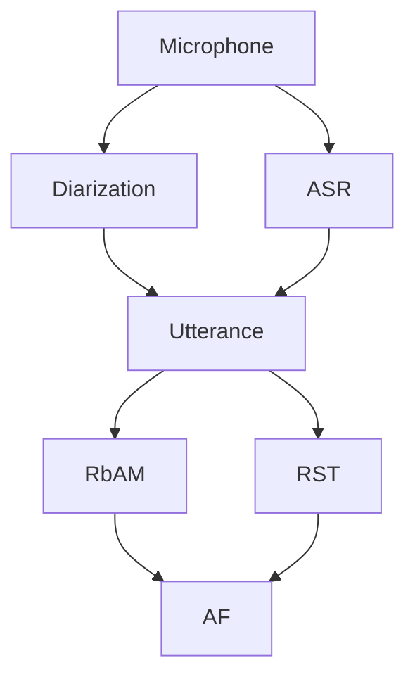

# retico-argumentation

A proof-of-concept project built in the ReTiCo framework. This system performs incremental relation based argument mining, RST parsing, and abstract argumentation framework solving, to provide a different perspective on a debate.

### Requirements

Requirements can be installed through pip:
```shell
pip install -r requirements.txt
```
You will likely want `cuBLAS` and `cuDNN` for GPU execution (see [here](https://pytorch.org/get-started/locally/)).
Make sure to `init` and `update` the submodules. If you run into any environment issues, follow the installation guides for the submodules as well. You will need two initial wav files for two speakers.


### Loading Initial Embeddings

The module requires an audio recording of each speaker. This is then used to generate some synthetic data for each speaker for a classifier.

You will need a backend to support `torchaudio.io` if you are loading initial wav files:
```
conda install -c conda-forge 'ffmpeg<7'
```
### Explanation
This module performs speaker diarization and automatic speech recognition (ASR) on microphone input. It operates under the assumption that two speakers are having an argument, every argument is an utterance, and every utterance belongs to one speaker. Once utterances are collected a rhetorical structure theory (RST) parser collects their RST tree structure, and a relation-based argument mining (RbAM) model checks which previous arguments the new argument conflicts with. These inputs are then fed to a model which constructs an abstract argumentation framework (AF). When the system shutsdown the AF solutions are output along with RST files for each argument. RST files can be opened with rstWeb, and af files can be opened with pyarg.

### System structure

